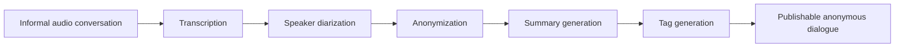
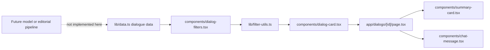

# Dialogoi Web

Dialogoi Web is the public interface for Dialogoi, a project for publishing productive conversations anonymously. The product idea comes from the wish to preserve informal discussions between friends - the kind of conversations about philosophy, technology, life, and personal perspective that can stay useful long after they happen - while protecting the people who took part in them.

This repository implements the web reading and discovery surface for that idea. It does not contain the audio processing model, a backend, a database, or a production publishing pipeline yet.

## What Dialogoi Is

Dialogoi is a space for turning real conversations into publishable dialogues.

The core product promise is simple:

- the ideas are real;
- the names are fictitious;
- the published conversation should be useful to readers;
- participant identity should stay protected;
- the final result should feel like a readable dialogue, not a raw transcript dump.

The About page in `app/sobre/page.tsx` is the current product source of truth. It describes Dialogoi as a way to share productive conversations without attaching identities to opinions that could be misunderstood outside their original context.

## Why It Exists

Dialogoi starts from a practical tension: some of the most valuable ideas come from casual, honest conversations, but publishing those conversations directly can expose people in ways they did not agree to.

The project exists to make those discussions readable and shareable while reducing that exposure. In the intended product experience, the reader should focus on the ideas, arguments, and reflections rather than the real identities behind them.

The name Dialogoi references the Greek tradition of dialogues, especially the idea that conversations can shape thought when they are preserved and made available to others.

## How The Product Is Intended To Work

The current About page describes an intended open source AI model that would transform private conversations into publishable dialogues.



Based on the product copy, the intended model responsibilities are:

- transcribe the complete conversation from audio;
- identify and separate each speaker through diarization;
- anonymize the participants;
- create a structured summary of the dialogue;
- generate relevant tags for organization and discovery;
- let other people use or adapt the model for their own conversations.

That model is not implemented in this web repository. The About page currently links to `https://github.com/seu-usuario/dialogoi-model`, which appears to be a placeholder URL for the future model repository.

## What This Repository Implements

This repository implements the current Dialogoi web app:

- a home page with the Dialogoi brand and archive list;
- client-side search, tag filtering, and sorting;
- cards for dialogue previews;
- dynamic dialogue detail pages;
- summary and participant blocks;
- ordered message rendering with speaker colors;
- an About page explaining the project motivation and future model direction.

The web app currently starts from local dialogue objects in `lib/data.ts`. Those objects stand in for the publishable dialogue output that the future model or content pipeline would eventually produce.

## Current Routes

| Route | File | Responsibility |
| --- | --- | --- |
| `/` | `app/page.tsx` | Renders the main Dialogoi surface with the header and dialogue discovery UI. |
| `/dialogo/[id]` | `app/dialogo/[id]/page.tsx` | Renders one dialogue from the local dataset, including date, tags, summary, participants, and ordered messages. |
| `/sobre` | `app/sobre/page.tsx` | Explains the project origin, anonymity motivation, intended AI workflow, and model direction. |

## Technology Stack

| Area | Implementation |
| --- | --- |
| Framework | Next.js 16 App Router |
| UI runtime | React 19 |
| Language | TypeScript |
| Styling | Tailwind CSS v4 with theme tokens in `app/globals.css` |
| UI primitives | shadcn-style components in `components/ui/*`, configured by `components.json` |
| Lower-level UI utilities | Base UI through `@base-ui/react` |
| Icons | `lucide-react` |
| Analytics | `@vercel/analytics` mounted in `app/layout.tsx` |
| Package manager | pnpm, based on `pnpm-lock.yaml` and `pnpm-workspace.yaml` |
| Linting | ESLint 9 with `eslint-config-next` |

## Project Structure

```text
dialogoi-web/
|-- app/
|   |-- dialogo/[id]/page.tsx  # Dialogue detail route
|   |-- sobre/page.tsx         # Product story and model direction
|   |-- globals.css            # Tailwind imports, CSS variables, and theme tokens
|   |-- layout.tsx             # Root layout, metadata, fonts, and analytics
|   `-- page.tsx               # Home route
|-- components/
|   |-- ui/                    # Reusable UI primitives
|   |-- chat-message.tsx       # Speaker-colored message row
|   |-- dialog-card.tsx        # Dialogue preview card
|   |-- dialog-filters.tsx     # Search, tag filter, sort, and list state
|   |-- header.tsx             # Main site header
|   `-- summary-card.tsx       # Dialogue summary and participants
|-- lib/
|   |-- data.ts                # Dialogue types, mock participants, and mock dialogues
|   |-- filter-utils.ts        # Pure filtering, sorting, and facet helpers
|   `-- utils.ts               # Shared className merge helper
|-- public/                    # Static image assets
|-- components.json            # shadcn component configuration
|-- next.config.ts             # Minimal Next.js config
|-- package.json               # Scripts and dependencies
|-- pnpm-lock.yaml             # pnpm lockfile
`-- pnpm-workspace.yaml        # Single-package pnpm workspace
```

`components/component-example.tsx` and `components/example.tsx` appear to be local UI demonstration components. They are not referenced by the current application routes.

## Dialogue Data Model

The current publishable dialogue shape is defined in `lib/data.ts`.

| Type | Key fields | Purpose |
| --- | --- | --- |
| `Participant` | `id`, `name`, `avatar`, `color` | Represents an anonymized speaker in a published dialogue. |
| `Message` | `id`, `participantId`, `content`, `order`, `timestamp` | Represents one ordered message in the readable dialogue transcript. |
| `Dialog` | `id`, `title`, `summary`, `participants`, `messages`, `createdAt`, `tags` | Represents one published dialogue entry. |

Helper functions:

- `getDialogById(id)` returns a dialogue from the local dataset.
- `getParticipantById(dialog, participantId)` resolves a message speaker within a dialogue.

The current sample data uses named participants and Portuguese copy. For production, the About page implies that participants should be anonymized before publication.

## Current Data Flow

The current repository begins after the intended AI/content pipeline. It assumes dialogue data already exists.



`components/dialog-filters.tsx` keeps filter state in the client, derives available tags from the local dataset, applies `filterAndSortDialogs`, and renders the visible card grid.

`app/dialogo/[id]/page.tsx` resolves one dialogue by route ID, sorts messages by `order`, and renders the dialogue as a readable conversation.

## Setup

Prerequisites:

- Node.js version compatible with Next.js 16.
- pnpm.

Install dependencies:

```bash
pnpm install
```

Start local development:

```bash
pnpm dev
```

No project-specific environment variables were identified.

## Available Scripts

| Script | Command | Purpose |
| --- | --- | --- |
| `dev` | `next dev` | Start the local Next.js development server. |
| `build` | `next build` | Create a production build. |
| `start` | `next start` | Serve a production build. |
| `lint` | `eslint` | Run ESLint using the Next.js config. |

## Validation

The only validation script currently defined by the repository is linting:

```bash
pnpm lint
```

No unit test, integration test, end-to-end test, or visual regression setup was identified.

## Known Gaps

- The AI model described on the About page is not implemented in this repository.
- There is no audio upload, transcription, diarization, anonymization, summary generation, or tag generation code in this web app.
- Dialogue content is currently hardcoded in `lib/data.ts`.
- No backend API, database, CMS, migration system, or persistent content storage was identified.
- No deployment-specific configuration, CI/CD workflow, Dockerfile, or production hosting notes were identified.
- The model repository URL in `app/sobre/page.tsx` appears to be a placeholder.
- The UI currently contains Portuguese visible copy and metadata, while this repository's documentation is written in English.
- `selectedParticipants` exists in `lib/filter-utils.ts` but is not exposed by the current filter UI.
- No license file was identified.

## License

TODO: no license file was identified in the current codebase.
