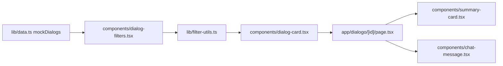

# Dialogoi Web

Dialogoi Web is a small Next.js archive interface for browsing curated dialogue-style conversations. The current application lets visitors search, sort, filter, preview, and read locally defined dialogue entries.

The project is intentionally compact: it is a single frontend app with static mock data, App Router pages, reusable UI primitives, and a small set of pure filtering utilities. No backend, database, authentication system, content pipeline, or production deployment configuration was identified in the current codebase.

## Current Status

This repository currently represents a working local/static prototype.

- Dialogue content is stored in `lib/data.ts`.
- The home page renders a searchable and filterable archive from local data.
- Dialogue detail pages are resolved from local IDs with `getDialogById`.
- Vercel Analytics is mounted in the root layout, but no Vercel project configuration or deployment workflow was found.
- The product story in `app/sobre/page.tsx` describes a future AI workflow for transcription, diarization, anonymization, summaries, and tags. That workflow is not implemented in this repository.
- Some visible app copy and metadata are currently in Portuguese. Workspace policy expects app strings to be written in English unless another language is explicitly requested, so the UI copy should be normalized in a future product pass.

## Product Purpose

Dialogoi is designed as a public reading surface for anonymized, productive conversations. The current web app focuses on discovery and readability:

- present a small catalog of conversations;
- make conversations searchable by title and summary;
- let visitors filter by tags;
- sort entries by date or title;
- open a dialogue detail page with metadata, summary, participants, and ordered messages.

## Main Features

- Sticky branded header with navigation to the about page.
- Home archive at `/` powered by `components/dialog-filters.tsx`.
- Search input for dialogue titles and summaries.
- Tag filters generated from the current dialogue dataset.
- Sort options for newest, oldest, A-Z, and Z-A.
- Card grid rendered with `components/dialog-card.tsx`.
- Dynamic dialogue route at `/dialogo/[id]`.
- Detail page summary via `components/summary-card.tsx`.
- Ordered chat transcript rendering via `components/chat-message.tsx`.
- About page at `/sobre` describing the project concept and intended future AI model.
- Static assets under `public/`, including the logo and about-page illustration.

## Routes

| Route | File | Responsibility |
| --- | --- | --- |
| `/` | `app/page.tsx` | Renders the main archive page with `Header` and `DialogFilters`. |
| `/dialogo/[id]` | `app/dialogo/[id]/page.tsx` | Loads a dialogue by ID from local data, renders metadata, summary, and ordered messages, and calls `notFound()` for unknown IDs. |
| `/sobre` | `app/sobre/page.tsx` | Explains the project concept and future model idea. |

## Technology Stack

| Area | Implementation |
| --- | --- |
| Framework | Next.js 16 App Router |
| UI runtime | React 19 |
| Language | TypeScript |
| Styling | Tailwind CSS v4 with CSS variables in `app/globals.css` |
| UI primitives | shadcn-style components in `components/ui/*`, configured by `components.json` |
| Lower-level UI utilities | Base UI through `@base-ui/react` |
| Icons | `lucide-react` |
| Analytics | `@vercel/analytics` mounted in `app/layout.tsx` |
| Package manager | pnpm, based on `pnpm-lock.yaml` and `pnpm-workspace.yaml` |
| Linting | ESLint 9 with `eslint-config-next` |

## Project Structure

```text
dialogoi-web/
├── app/
│   ├── dialogo/[id]/page.tsx  # Dialogue detail route
│   ├── sobre/page.tsx         # About page
│   ├── globals.css            # Tailwind import, theme tokens, and global styles
│   ├── layout.tsx             # Root layout, metadata, fonts, and Vercel Analytics
│   └── page.tsx               # Home route
├── components/
│   ├── ui/                    # Reusable UI primitives
│   ├── chat-message.tsx       # Message row for dialogue transcripts
│   ├── dialog-card.tsx        # Archive card for a dialogue
│   ├── dialog-filters.tsx     # Client-side search, tag filter, sort, and grid state
│   ├── header.tsx             # Main site header
│   └── summary-card.tsx       # Dialogue summary and participant block
├── lib/
│   ├── data.ts                # Dialogue, participant, and message types plus mock data
│   ├── filter-utils.ts        # Pure filtering, sorting, and facet helpers
│   └── utils.ts               # Shared className merge helper
├── public/                    # Static image assets
├── components.json            # shadcn component configuration
├── next.config.ts             # Minimal Next.js config
├── package.json               # Scripts and dependencies
├── pnpm-lock.yaml             # pnpm lockfile
└── pnpm-workspace.yaml        # Single-package pnpm workspace
```

`components/component-example.tsx` and `components/example.tsx` appear to be local UI demonstration components. They are not referenced by the current application routes.

## Data Model

The current data model lives in `lib/data.ts`.

| Type | Key fields | Purpose |
| --- | --- | --- |
| `Participant` | `id`, `name`, `avatar`, `color` | Represents a speaker in a dialogue. The color is used for avatars and speaker labels. |
| `Message` | `id`, `participantId`, `content`, `order`, `timestamp` | Represents a single message in a transcript. Detail pages sort by `order`. |
| `Dialog` | `id`, `title`, `summary`, `participants`, `messages`, `createdAt`, `tags` | Represents one archive entry. |

Helper functions:

- `getDialogById(id)` returns a local dialogue or `undefined`.
- `getParticipantById(dialog, participantId)` finds a speaker inside a dialogue.

The repository does not currently include a CMS, markdown content layer, database, API fetcher, migration system, seed script, or persistent storage.

## Data Flow



The home page is the only interactive data surface. It keeps filter state in the client, derives tag facets from `mockDialogs`, applies `filterAndSortDialogs`, and renders the resulting card grid. The detail page is server-rendered from route params and local data.

## Filtering And Sorting

`lib/filter-utils.ts` contains the reusable filtering logic:

- `searchText` matches dialogue titles and summaries.
- `selectedTags` uses OR matching against dialogue tags.
- `selectedParticipants` is implemented in the utility layer but is not currently exposed in the UI.
- `sortBy` supports date descending, date ascending, title ascending, and title descending.
- `getAllTags` extracts sorted unique tags from the current dialogues.
- `getAllParticipants` extracts sorted unique participants, but the current UI does not use it.

## Prerequisites

- Node.js version compatible with Next.js 16.
- pnpm.

No project-specific environment variables were detected.

## Installation

```bash
pnpm install
```

## Local Development

```bash
pnpm dev
```

This command starts the Next.js development server. Do not assume a production-like data source when running locally; all dialogue entries are loaded from `lib/data.ts`.

## Available Scripts

| Script | Command | Purpose |
| --- | --- | --- |
| `dev` | `next dev` | Start the local Next.js development server. |
| `build` | `next build` | Create a production build. |
| `start` | `next start` | Serve a production build. |
| `lint` | `eslint` | Run ESLint using the Next.js config. |

## Validation

The repository currently exposes linting only:

```bash
pnpm lint
```

No unit test, integration test, end-to-end test, or visual regression setup was identified in the current codebase.

## External Services

The only external runtime integration found in the source code is Vercel Analytics:

- dependency: `@vercel/analytics`;
- usage: `Analytics` from `@vercel/analytics/next`;
- mount point: `app/layout.tsx`.

No API service, database provider, authentication provider, storage bucket, queue, email service, or model-serving service is wired into this app.

## Deployment

No deployment-specific configuration was identified. The repository contains the standard Next.js scripts needed for a production build, but it does not include a Vercel project configuration, Dockerfile, GitHub Actions workflow, release script, hosting notes, or production environment documentation.

Before treating this app as production-ready, define:

- the intended hosting provider;
- the content ownership and publication process;
- whether local mock data should be replaced with a CMS, file-based content system, or backend API;
- analytics and privacy expectations;
- the final public URL for the model repository referenced from the about page.

## Known Limitations

- Content is hardcoded in `lib/data.ts`.
- There is no durable content source or editorial workflow.
- There is no implemented pipeline for audio ingestion, transcription, diarization, anonymization, summary generation, or tag generation.
- The about page links to `https://github.com/seu-usuario/dialogoi-model`, which appears to be a placeholder.
- Some visible app strings and metadata are Portuguese even though the workspace policy expects app strings in English by default.
- `selectedParticipants` exists in the filter state and utilities but is not exposed by the current filter UI.
- `components/component-example.tsx` includes demonstration UI unrelated to the current product routes.
- No automated tests were identified.
- No license file was identified.

## License

TODO: no license file was identified in the current codebase.
